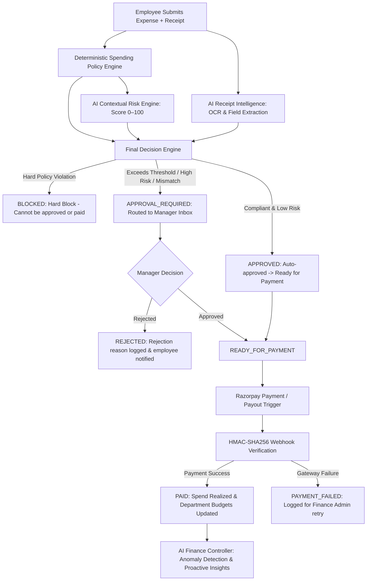

# SpendGuard AI — AI Finance Controller

> **Control every spend. Catch every risk.**

🌐 **Live Production Deployment:** [https://spend-guard-ac9i.vercel.app](https://spend-guard-ac9i.vercel.app/)  
📦 **GitHub Repository:** [https://github.com/aryansingh-00/SpendGuard](https://github.com/aryansingh-00/SpendGuard)

**SpendGuard AI** is a production-grade AI Finance Controller built for modern enterprises to control, verify, approve, and analyze employee and business spending before and after payments occur.

---

## 🔄 The Complete SpendGuard AI Lifecycle



---

## 🌟 Core System Pillars

### 1. Deterministic Spending Policy Engine
* Hard corporate spending rules (company, department, and employee budget envelopes).
* Per-transaction limits, approval thresholds, category whitelists/blacklists, and merchant controls.
* **Deterministic Supremacy**: Hard policy violations (`BLOCKED`) can never be overridden by AI or bypassed by managers.

### 2. AI Transaction Risk Engine
* Grounded 0–100 risk scoring (`LOW`, `MEDIUM`, `HIGH`, `UNAVAILABLE`).
* Observable signals: Amount outliers (`UNUSUAL_AMOUNT`), merchant novelty (`NEW_MERCHANT`), category mismatches (`CATEGORY_MISMATCH`), duplicate detection (`POSSIBLE_DUPLICATE`), and budget velocity pressure.
* Fact-grounded system prompts with Zod schema validation and graceful heuristic fallback.

### 3. AI Receipt Intelligence & Claim Verification
* Multi-modal document parsing (PDF, PNG, JPG, WebP) with cryptographic SHA-256 hash deduplication.
* Sub-second structured extraction: Merchant, total amount, transaction date, category, tax, line items, and missing fields.
* 100-Point Weighted Verification Matcher (Amount 40 pts, Merchant 25 pts, Date 15 pts, Currency 10 pts, Category 10 pts).
* Mismatch and anomaly detection: Escalates amount discrepancies and duplicate receipts directly to reviewers.

### 4. Manager Approval Center (`/dashboard/approvals`)
* **Automated Approver Resolution**: Intelligently routes requests to the designated Department Manager, or falls back to company Finance Admins.
* **Live Budget Impact Breakdown**: Real-time visualization of current spent, available remaining, transaction amount, and projected balance after approval.
* **Anti-Self-Approval & Concurrency Defense**: Database transactions prevent self-approvals, double-approvals, or conflicting reviews.

### 5. Razorpay Integration & Webhook Handler
* Direct checkout orders and business payout transactions.
* Constant-time `crypto.timingSafeEqual` HMAC-SHA256 cryptographic webhook signature verification.
* Replay-safe idempotency guarantees preventing duplicate debits or corrupted analytics.
* Interactive Razorpay Webhook Simulator on the Settings page (`/settings`).

### 6. AI Finance Controller Dashboard (`/dashboard`)
* Total Spend with $\pm\text{X}\%$ deterministic period comparison vs previous period.
* Spending Velocity trend chart, Category breakdown, Department Budget Health progress bars, and Top Merchants.
* Proactive AI Insights: Anomaly detection engine with expandable *"Why am I seeing this?"* evidence chips and direct action buttons.

---

## 👥 Demo Personas & Pre-Seeded Accounts

The database comes pre-seeded with **Acme Technologies** (Monthly Budget: ₹10,00,000):

| Role | Name | Email | Password | Scope & Responsibilities |
|---|---|---|---|---|
| **FINANCE_ADMIN** | Priya Sharma | `admin@acme.com` | `Password@123` | Company-wide executive control, analytics, policy simulator, payment settlement |
| **MANAGER** | Ananya Iyer | `manager@acme.com` | `Password@123` | VP of Engineering; Engineering approvals inbox, department budget oversight |
| **EMPLOYEE** | Rahul Verma | `rahul@acme.com` | `Password@123` | Senior Software Engineer; AWS cloud infrastructure claims |
| **EMPLOYEE** | Priya Patel | `priya@acme.com` | `Password@123` | Marketing Lead; High-risk cryptocurrency vendor claim |
| **EMPLOYEE** | Amit Shah | `amit@acme.com` | `Password@123` | Sales Lead; Hard-blocked gambling claim |
| **EMPLOYEE** | Neha Gupta | `neha@acme.com` | `Password@123` | Operations Specialist; Receipt mismatch claim (Claim: ₹18.5k vs Receipt: ₹8.5k) |

---

## 🚀 Quick Start Guide

### 1. Install Dependencies
```bash
npm install
```

### 2. Configure Environment Variables
Copy `.env.example` to `.env` (or use the configured SQLite default):
```env
DATABASE_URL="file:./dev.db"
JWT_SECRET="spendguard-super-secret-jwt-key"
AI_PROVIDER="gemini" # or "mock"
GEMINI_API_KEY="your-gemini-api-key"
RAZORPAY_KEY_ID="rzp_test_..."
RAZORPAY_KEY_SECRET="your-key-secret"
RAZORPAY_WEBHOOK_SECRET="spendguard_webhook_secret"
```

### 3. Initialize & Seed Database
```bash
npx prisma db push
npm run demo:reset
```

### 4. Run Development Server
```bash
npm run dev
```
Open [http://localhost:3000](http://localhost:3000) in your browser.

---

## 🧪 Automated Test Suite

Run the full end-to-end verification and regression test suites:

```bash
# Milestone 9: End-to-End Hardening & Full Lifecycle Test Suite
npx tsx test/verify_milestone9.ts

# Milestones 2 through 8 Regression Suites
npx tsx test/verify_milestone8.ts
npx tsx test/verify_milestone7.ts
npx tsx test/verify_milestone6.ts
npx tsx test/verify_milestone5.ts
npx tsx test/verify_milestone4.ts
npx tsx test/verify_milestone3.ts
npx tsx test/verify_milestone2.ts

# Production Type-Check & Next.js Build
npx tsc --noEmit
npm run build
```
